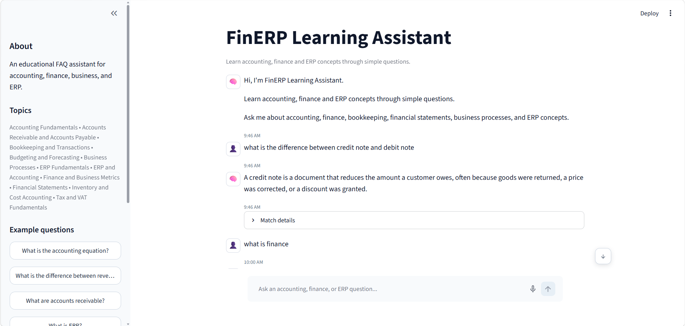
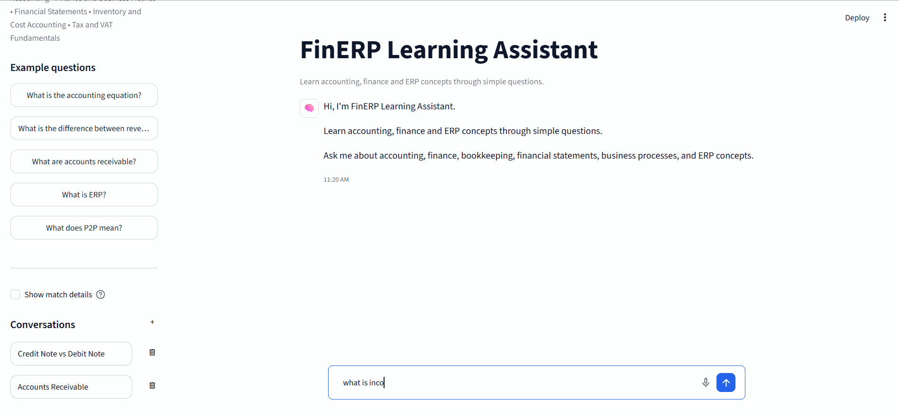
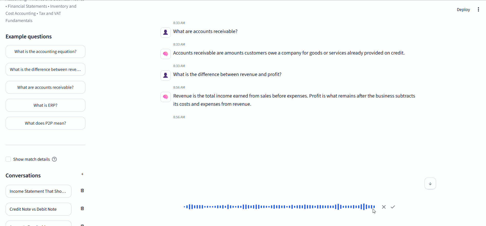
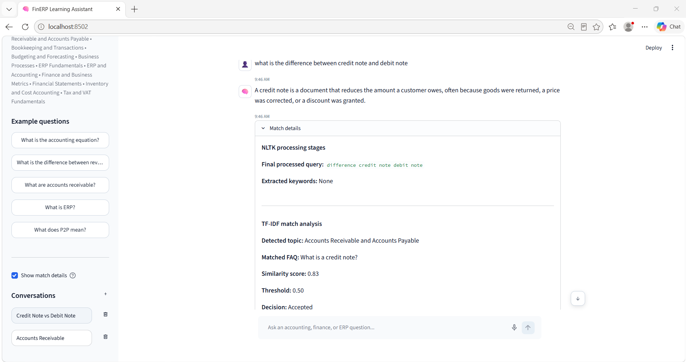
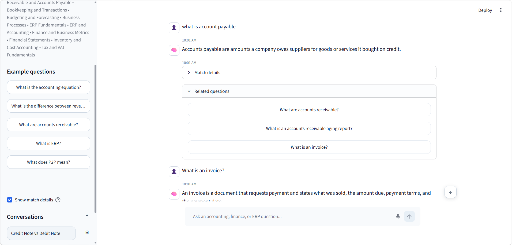

# 🧠 FinERP Learning Assistant

**FinERP Learning Assistant** is an AI-based FAQ chatbot developed as part of my **Artificial Intelligence Internship at Horizon TechX**.

The application is designed to help users learn and explore concepts related to **accounting, finance, bookkeeping, financial statements, ERP systems, business processes, inventory, budgeting, and VAT** through a simple conversational interface.

Instead of relying on exact keyword matching, FinERP uses **Natural Language Processing (NLP)**, **TF-IDF vectorization**, and **cosine similarity** to understand a user's question and retrieve the most relevant answer from its knowledge base.

---

## ✨ Features

### 💬 Intelligent FAQ Matching
Users can ask questions naturally instead of having to type the exact FAQ wording.

Example:

```text
User: customer owes us money

FinERP:
Accounts receivable are amounts customers owe a company
for goods or services already provided on credit.
```

The chatbot compares the user's question against its FAQ knowledge base and returns the closest relevant answer.

### 🧠 NLP Text Preprocessing

User queries are processed using **NLTK** before matching.

The preprocessing pipeline includes:

1. Converting text to lowercase
2. Tokenization
3. Removing punctuation and non-meaningful tokens
4. Removing English stopwords
5. Lemmatization
6. Creating the final processed text

Mixed alphanumeric business abbreviations such as:

```text
P2P
O2C
R2R
```

are preserved during preprocessing.

---

### 📊 TF-IDF Vectorization

The FAQ questions are converted into numerical vectors using:

```python
TfidfVectorizer
```

TF-IDF assigns importance to words based on how relevant they are within the FAQ knowledge base.

The current dataset contains:

```text
80 FAQs
11 Topics
TF-IDF Matrix: 80 × 121
```

---

### 📐 Cosine Similarity

After preprocessing the user's question, FinERP converts it into a TF-IDF vector and compares it with every FAQ using **cosine similarity**.

The FAQ with the highest similarity score becomes the candidate response.

```text
User Question
      ↓
NLTK Preprocessing
      ↓
TF-IDF Vector
      ↓
Cosine Similarity
      ↓
Best FAQ Match
      ↓
Threshold Check
      ↓
Response / Fallback
```

---

### 🎯 Confidence Threshold

FinERP uses a similarity threshold of:

```python
SIMILARITY_THRESHOLD = 0.50
```

If the best FAQ match has a score of at least `0.50`, the answer is accepted.

Otherwise, the chatbot safely returns a fallback response instead of providing an unrelated answer.

---

### 🔎 NLP Match Details

An optional **Show match details** mode makes the NLP pipeline visible for educational and debugging purposes.

It can display:

- Original query
- Lowercase text
- Tokens
- Meaningful tokens
- Tokens after stopword removal
- Lemmatized tokens
- Final processed query
- Extracted keywords
- Detected topic/category
- Best matched FAQ
- Cosine similarity score
- Similarity threshold
- Final accepted/rejected decision

This makes it possible to see how the chatbot processes and interprets a question internally.

---

### 🔗 Related Questions

After finding a confident FAQ match, FinERP can recommend related questions.

Recommendations are generated using:

- FAQ category
- TF-IDF similarity
- Cosine similarity

This allows users to continue exploring related accounting, finance, and ERP concepts.

---

### 🎙️ Speech-to-Text Input

FinERP supports microphone input.

Users can:

1. Record a question
2. Convert speech into text
3. Review the recognized text
4. Edit it if necessary
5. Send it through the normal NLP pipeline

Speech recognition is integrated using the Python `SpeechRecognition` package.

---

### 💬 Conversation History

FinERP includes a local conversation system inspired by modern AI chat interfaces.

Users can:

- Create multiple conversations
- Switch between previous conversations
- Automatically generate conversation titles
- Delete individual conversations
- Confirm deletion through a dialog
- Preserve conversations locally

Conversation history is stored locally in:

```text
data/conversations.json
```

---

### ⚡ Interactive Chat Experience

The interface also includes:

- Animated assistant introduction
- Typing indicator
- User and assistant chat bubbles
- Message timestamps
- Suggested questions
- Related-question expanders
- Smooth scroll-to-latest-message control
- Conversation selection states
- Responsive sidebar
- Microphone integration

---

## 📚 Knowledge Base

The chatbot currently contains **80 FAQ entries across 11 categories**:

1. Accounting Fundamentals
2. Financial Statements
3. Bookkeeping and Transactions
4. Accounts Receivable and Accounts Payable
5. Inventory and Cost Accounting
6. Finance and Business Metrics
7. Budgeting and Forecasting
8. ERP Fundamentals
9. ERP and Accounting
10. Business Processes
11. Tax and VAT Fundamentals

The FAQ knowledge base is stored in:

```text
data/faqs.json
```

Each FAQ contains a question, answer, category, and unique identifier.

---

## 🧪 Evaluation

The chatbot was stress-tested using **45 different queries** covering all 11 knowledge categories as well as unrelated questions.

### Results

| Evaluation | Result |
|---|---:|
| Total test queries | 45 |
| Relevant queries | 40 |
| Correct accepted matches | 40 / 40 |
| Unrelated queries | 5 |
| Correct fallbacks | 5 / 5 |
| Incorrect accepted matches | 0 |
| Relevant queries incorrectly rejected | 0 |

Examples of tested queries:

| Query | Similarity | Result |
|---|---:|---|
| What does a company own? | 1.00 | Assets |
| What does a company owe? | 1.00 | Liabilities |
| What does P2P mean? | 0.75 | Procure-to-Pay |
| What statement shows profit? | 0.74 | Income Statement |
| What happens between buying something and paying the supplier? | 0.54 | Procure-to-Pay |
| What is O2C? | 1.00 | Correct |
| What is R2R? | 1.00 | Correct |
| What is the weather in Beirut? | 0.00 | Rejected |
| Tell me a joke. | 0.00 | Rejected |

These tests helped validate the `0.50` similarity threshold and identify weaknesses in the FAQ dataset and preprocessing pipeline.

---

## 🛠️ Technologies Used

### Language

- Python

### NLP

- NLTK
- Tokenization
- Stopword Removal
- Lemmatization

### Machine Learning / Text Similarity

- Scikit-learn
- TF-IDF
- Cosine Similarity

### Interface

- Streamlit
- HTML
- CSS
- JavaScript

### Speech Recognition

- SpeechRecognition

### Data

- JSON

---

## 📁 Project Structure

```text
HorizonTechX_AI_Based_FAQ_Chatbot/
│
├── app.py
│
├── chatbot.py
├── preprocess.py
├── requirements.txt
│
├── data/
│   ├── faqs.json
│   └── conversations.json
│
├── .streamlit/
│
├── explication.md
│
└── README.md
```

### Main Files

**`app.py`**

Contains the Streamlit interface, chat experience, conversation management, speech input, animations, and UI behavior.

**`chatbot.py`**

Contains the FAQ loading, TF-IDF vectorization, cosine similarity matching, confidence threshold, and related-question logic.

**`preprocess.py`**

Contains the reusable NLTK preprocessing pipeline.

**`data/faqs.json`**

Contains the FinERP FAQ knowledge base.

**`data/conversations.json`**

Stores local conversation history.

**`explication.md`**

Contains development notes, experiments, testing results, design decisions, and implementation explanations.

---

## ⚙️ How It Works

When a user asks:

```text
What does P2P mean?
```

FinERP performs the following pipeline:

```text
Raw User Question
        ↓
Lowercase Conversion
        ↓
Tokenization
        ↓
Meaningful Token Filtering
        ↓
Stopword Removal
        ↓
Lemmatization
        ↓
Processed Query
        ↓
TF-IDF Vectorization
        ↓
Cosine Similarity Against FAQ Vectors
        ↓
Highest Similarity FAQ
        ↓
Similarity >= 0.50?
       /       \
     YES        NO
      ↓          ↓
FAQ Answer    Fallback
      ↓
Related Questions
```

---

## 🎥 Project Showcase

### 🖥️ FinERP Learning Assistant

FinERP provides a modern conversational interface for exploring **accounting, finance, bookkeeping, business processes, and ERP concepts** through an NLP-based FAQ retrieval system.

<p align="center">
  
</p>

---

### 💬 Chatbot Workflow

Users can ask questions naturally and receive the most relevant response from the FAQ knowledge base.

The chatbot also recommends **Related Questions**, allowing users to continue exploring connected concepts directly from the conversation.

<p align="center">
  
</p>

---

### 🎙️ Voice Input

FinERP supports **speech-to-text input**, allowing users to ask questions using their microphone.

The spoken question is converted into text and placed into the chat input, where it can be reviewed, edited, and submitted normally.

<p align="center">
  
</p>

---

### 🧠 NLP Match Analysis

The optional **Show match details** feature exposes the NLP pipeline behind each response for educational and debugging purposes.

It displays:

- Tokenization
- Meaningful token filtering
- Stopword removal
- Lemmatization
- Final processed query
- Extracted keywords
- Detected topic
- Matched FAQ
- TF-IDF cosine similarity score
- Similarity threshold
- Final accepted/rejected decision

<p align="center">
  
</p>

---

### 🔗 Related Questions

After a confident FAQ match, FinERP recommends related questions based on the **matched category and TF-IDF similarity**.

Users can select one of these questions to immediately continue the conversation and explore related accounting, finance, or ERP concepts.

<p align="center">
  
</p>

---

## 🚀 Running the Project Locally

### 1. Clone the repository

```bash
git clone YOUR_REPOSITORY_URL
```

### 2. Navigate to the project

```bash
cd HorizonTechX_AI_Based_FAQ_Chatbot
```

### 3. Create a virtual environment

```bash
python -m venv venv
```

### 4. Activate the virtual environment

#### Windows

```bash
venv\Scripts\activate
```

#### macOS / Linux

```bash
source venv/bin/activate
```

### 5. Install dependencies

```bash
pip install -r requirements.txt
```

### 6. Run the application

```bash
streamlit run app.py
```

Streamlit will provide a local URL, typically:

```text
http://localhost:8501
```

---

## 💡 Example Questions

Try asking FinERP:

```text
What is the accounting equation?

What are accounts receivable?

What is the difference between revenue and profit?

What does FIFO mean?

What is ERP?

Why would a business need an ERP?

What does P2P mean?

What is O2C?

What is R2R?

What is VAT?
```

You can also use more natural phrasing:

```text
customer owes us money

we owe a supplier money

what does a company own?

what statement shows profit?

what happens between buying something and paying the supplier?
```

---

## ⚠️ Limitations

FinERP intentionally uses a lightweight and explainable NLP architecture rather than a large language model.

Because the chatbot relies on **TF-IDF and lexical similarity**:

- Completely unseen synonyms may produce weaker similarity scores.
- Concepts missing from the FAQ knowledge base cannot be answered reliably.
- Some valid queries can score close to the similarity threshold.
- New abbreviations may require additional FAQ coverage.
- The chatbot does not generate new financial advice or factual information outside its knowledge base.

These limitations make the system easier to understand and demonstrate while also showing why more advanced semantic NLP models can improve chatbot retrieval.

---

## 🎯 Project Goals

This project was built to practice and demonstrate:

- Natural Language Processing
- Text preprocessing with NLTK
- Tokenization
- Stopword removal
- Lemmatization
- TF-IDF vectorization
- Cosine similarity
- FAQ retrieval
- Similarity thresholds
- NLP evaluation
- Speech-to-text interaction
- Streamlit application development
- Conversational UI/UX design

---

## 🔮 Possible Future Improvements

Although the current internship version is considered feature-complete, possible future experiments could include:

- Semantic embeddings
- Sentence Transformers
- Named Entity Recognition (NER)
- Intent classification
- spaCy NLP pipelines
- Multilingual queries
- Larger knowledge bases
- Database-backed conversation storage
- User authentication
- Hybrid lexical + semantic retrieval

These are intentionally left outside the current scope to keep the project focused on its original NLP FAQ retrieval architecture.

---

## 👨‍💻 Author

**Ahmad Serhal**

Computer Science graduate, Full-Stack Web Developer, and Master's student in Artificial Intelligence.

This project was developed as part of my **Artificial Intelligence Internship at Horizon TechX**.

---

## 📄 Internship Project

**Organization:** Horizon TechX  
**Track:** Artificial Intelligence Internship  
**Project:** AI-Based FAQ Chatbot  
**Application:** FinERP Learning Assistant  
**Domain:** Accounting, Finance & ERP  
**Core NLP Approach:** NLTK + TF-IDF + Cosine Similarity

---

⭐ If you found this project useful, feel free to explore the repository and try the FinERP Learning Assistant.